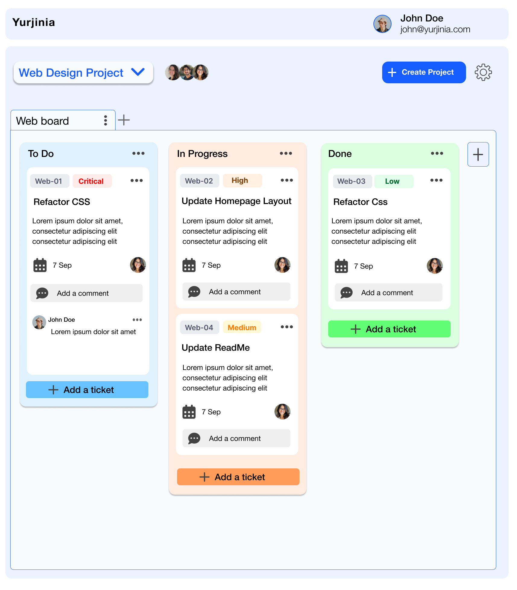

# Yurjinia Frontend

## Identifying Components

This frontend is designed to align with the [Yurjinia Java backend](https://github.com/Yurjinia/Yurjinia).  
I reviewed the backend code to understand entities and workflows, then mapped out the **key UI components** needed.

## Wireframing & Iteration

After **Samvel Aivazian** (backend engineer) asked if I could create a frontend, I accepted the challenge.  
He suggested a minimalistic, Jira-like design, but I explored multiple layouts over a few weeks before shaping the best balance between **simplicity and functionality**.

## Collaboration & Refinement

The wireframes were refined through reviews with Samvel to ensure **frontend–backend alignment** and smooth integration paths.

## Technology Stack

Development has now started with **React + TypeScript**, bringing the wireframes to life as interactive components.
